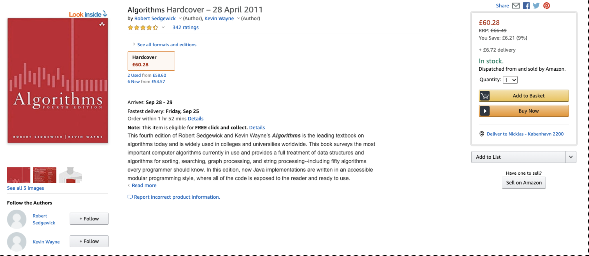
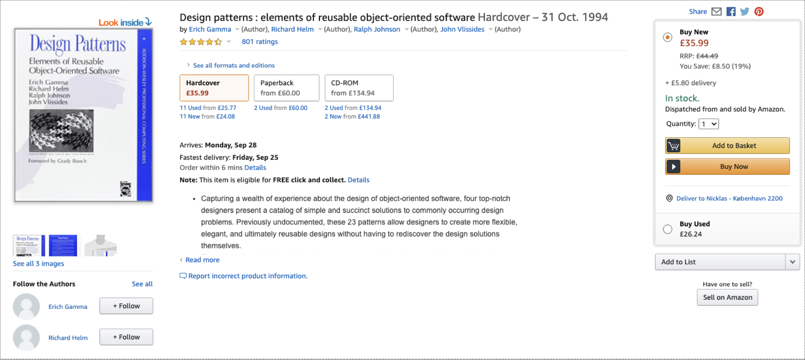
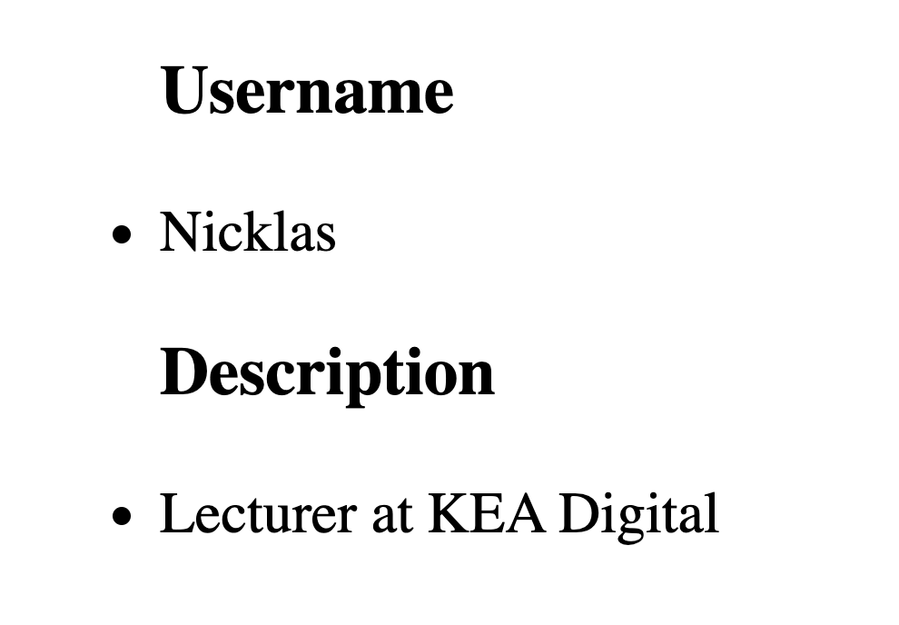
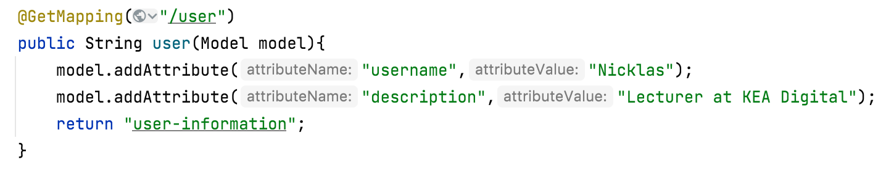

# Thymeleaf

**Example Github repository:** [https://github.com/2-semester-programmering/Tweater](https://github.com/2-semester-programmering/Tweater)

### Overview

Thymeleaf is a template engine. Thymeleaf creates dynamic **templates** with dynamic **content**.

Consider the following two views from Amazon:





As we can tell - most of the content on the HTML page are the same - but we are viewing different book **entities** on the same "template" page. If Amazon had to write a new HTML page every time a new book was available they would have to write and maintain more than 12.000.000 HTML pages.

**Enter templates**

On a template, we can outline the basic "skeleton" for a page, and dynamically fill out the blanks using thymeleaf Templates and data from the server.

**Basic syntax**

**Consider the following example:**

```html
<!DOCTYPE html>
<html lang="en">
<head>
    <meta charset="UTF-8">
    <title>User Information</title>
</head>
<body>
  <ul>
    <h3>Username</h3>
    <li>Nicklas</li>
    <h3>Description</h3>
    <li>Lecturer at KEA Digital</li>
  </ul>
</body>
</html>
```

**Interpreted in the browser as:**



**A controller that routes to the static page**

```java
@GetMapping("/user")
public String user(){
    return "user-information";
}
```

This is an example of **static** content. If the objective is to make this dynamic by thymeleaf, we need to add data to the view.

### Adding data to the view

To make this view dynamic, we need to make changes to the controller **such that it adds data to the view**

```java
import org.springframework.ui.Model;
```

```java
@GetMapping("/user")
public String user(Model model){
	model.addAttribute("username","Nicklas");
  model.addAttribute("description","Lecturer at KEA");
  return "user-information";
}
```

To achieve this - we need to import a class from Spring called Model and inject that model into the GetMapping by its parameter.



**Which will render the same view**


\*\*But! \*\* the changes are now - that we have added data from the Java-backend and can dynamically change content from the applicaiton.

#### Adding an object to the template

Consider the following model:

```java
public class User {
    private String username;
    private int age;

    public User(String username, int age) {
        this.username = username;
        this.age = age;
    }

    public String getUsername() {
        return username;
    }

    public void setUsername(String username) {
        this.username = username;
    }

    public int getAge() {
        return age;
    }

    public void setAge(int age) {
        this.age = age;
    }
}
```

Consider the following repository:

```java
public class UserRepository {

    public User getSingleUser(){
        //Later we should implement this as a feature that fetches from the database
        User testUser = new User("Nicklas", 31);
        //We are returning a single user object as a test
        return testUser;
    }
}
```

Consider the following controller:

```java
@GetMapping("/user")
public String user(Model model){
    User userToDisplay = repo.getSingleUser(); //Fetching the user object from the repository
    model.addAttribute("user",userToDisplay);
    return "user-information";
}
```

The object is added to the view and can be displayed like in the template user-information:

```html
<!DOCTYPE html>
<html lang="en">
<head>
    <meta charset="UTF-8">
    <title>User Information</title>
</head>
<body>
  <ul>
    <h3>Username</h3>
    <li th:text="${user.getUsername()}"></li>
    <h3>Age</h3>
    <li th:text="${user.getAge()}"></li>
  </ul>
</body>
</html>
```

### Thymeleaf syntax

**Thymeleaf variables**

A variable containing data can be added in the controller method:

```java
@GetMapping("/user")
public String user(Model model){
  	String username = "Nicklas";
    model.addAttribute("name", username); //Adding data to the view
    return "user-information"; // Returning name of view
}
```

Displayed in the HTML like this:

`<li th:text="${name}"></li>`

**Thymeleaf boolean logic**

https://www.baeldung.com/spring-thymeleaf-conditionals

**Thymeleaf iterations**

https://www.baeldung.com/thymeleaf-iteration

**Thymeleaf fragments**

https://www.baeldung.com/spring-thymeleaf-fragments

## Exercise 1

**In the FreeMoneyNoScamApplication:**

* Write a class EmailRepository
  * EmailRepository has a method: fetchSingleEmail
  * The method returns a String that contains an email
* Write a controller EmailController
  * The Controller returns an HTML page
  * The Controller adds an e-mail from the "fetchSingleEmail" method
* Write an HTML template that displays the email using Thymeleaf

### Refactor the code

* Add a method to EmailRepository
  * fetchAllEmails
  * The method returns a list of 4 e-mails
* Refactor the template such that all e-mails are displayed

## Advanced (Optional)

Write an application that:

* Fetches news from an XML stream from a mainstream news-outlet. (This could be BT, Ekstra Bladet, Politiken etc.)
* Displays the news from a mainstream news-outlet.
