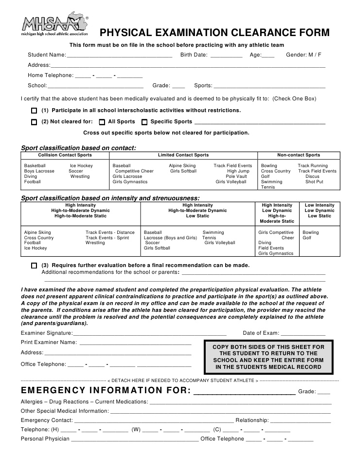
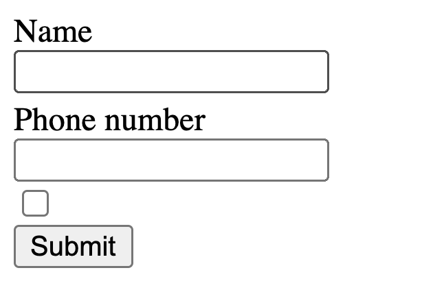
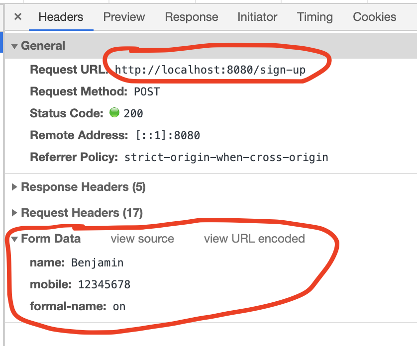
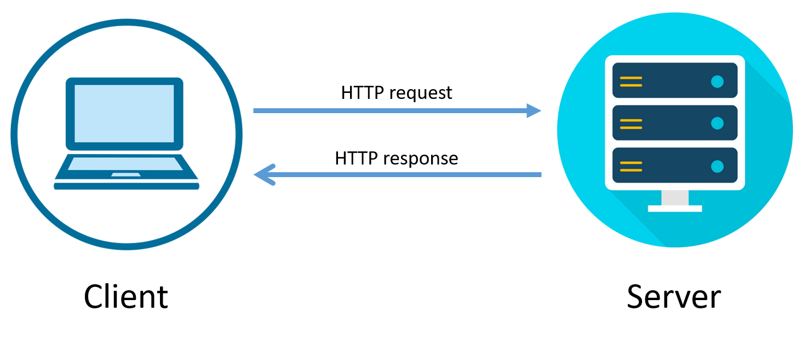
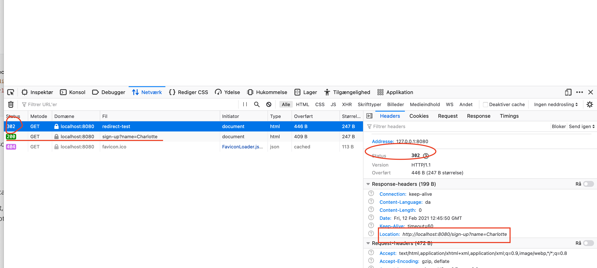

# Dynamic Web Applications: HTML Forms

Sending data to a server is essential for interacting with a website user. Create a new user, booking online flight tickets, ordering a product online.

## Learning goals

- HTML forms
- `@PostMapping`
- `redirect`
- PRG pattern

## HTML Forms

HTML forms is used for sending data to the server. it comes from physical forms like these:

[](https://github.com/behu-kea/dat20-classes/blob/master/HTML Forms/assets/physical-forms.png)

## GET request vs POST request

There are quite a lot of different request types. We will focus on `GET` and `POST`:

- **GET request** - Getting information. Fx get all the information we have on the user with id 1. Or simply get the html at the `/about` url
- **POST request** - Creating new information. Fx creating a new user, making a new order, creating new facebook post.

### Creating a form

Here is an example of a form

```html
<form action="/sign-up" method="POST">
    <label for="name">Name</label>
  	<input type="text" name="name"/>
	  <label for="mobile">Name</label>
    <input type="tel" name="mobile" />
    <input type="checkbox" name="formal-name"/>

    <button type="submit">Submit</button>
</form>
```

Interpreted by the browser - it should look something like this



There are a few things going on. Lets disect it:

The `action` attribute decides what url the form data should be send to.

`method="POST"` - The `method` attribute decides what kind of request to make. When posting we will  be using a `POST` request because we are creating a new user.

`<label for="mobile">Phone number</label>` This is a label that is connected to some field. It helps the user to identify what to enter into the connected field. The connection between `label` and field happens with the `for` attribute and the `id` or `name` on the field.

`type="text"` - `input` fields can have a type. There are quite a lot of [types](https://www.w3schools.com/html/html_form_input_types.asp). it can help the user and also do a bit of validation on the frontend. So fx if you specify `type="number"` then the number keyboard will come up on the users smartphone.

`name="mobile"` - When we send the data to a server, then name decides the key of that field. See below. Here is the `POST` request

[


## PostMapping

[](https://github.com/behu-kea/dat20-classes/blob/master/HTML Forms/assets/client-server.png)

Now we have figured out how to send the `POST` request (with data) to the server using forms. Now we need to figure out how to get that data in our `@controller`

```java
@PostMapping("/sign-up")
public String createNewUser(WebRequest request) {
  	String username = request.getParameter();
    String password = request.getParameter();
    return "success";
}
```

Using the `@PostMapping` notation we can use it just like the `@GetMapping` specifying a `value` that will be the endpoint.

To get data out of the `POST` request use `WebRequest objects getParameter()`. `getParameter()` specifies the key you are looking for.


## Redirect

Some times we are interested in making the user go to another website than the one he put in the url or was directed to. For this we use forwards and redirects

Using the redirect prefix we can redirect to another page: `redirect:/URL_TO_REDIRECT_TO`

```java
// Redirect with prefix redirect
@GetMapping("redirect-prefix-test-simple")
public String redirectViewPrefixSimple() {
    // adding query parameters to the redirected page
    return new String("redirect:/sign-up");
}
```

Using query parameters

```java
// Redirect with prefix redirect
@GetMapping("redirect-prefix-test")
public ModelAndView redirectViewprefix(ModelMap model) {
    // adding query parameters to the redirected page
    model.addAttribute("name", "Louise");
    return new ModelAndView("redirect:/sign-up", model);
}
```

#### Redirect behind the scenes

Below is how the redirect will work behind the scenes. What does the 302 mean?

[](https://github.com/behu-kea/dat20-classes/blob/master/HTML Forms/assets/redirect.png)

So the redirect says : "Hey browser i have actually moved this url by sending the `302` response code".

Now the browser asks: "Sound good server, but where have you moved the url to???".

The server responds: "Just look at the `response header` called `Location`. Thats where the url has been moved to!".

The browser now loads the new url found under the `Location` header!


## Post, redirect, get pattern

Good youtube video: https://www.youtube.com/watch?v=DCC7ufuFD2w

Imagine a user submits a form and reloads the page. Now that form request will be sent twice. Resulting in two database instances.

With this new pattern a server receives a request, saves the data (`createProduct`) and then redirects the user to a confirmation page using `GET` not `POST` (`createProductPageSuccess`)

```java
@Controller
public class PostRedirectGet {
    @GetMapping("create-product")
    public String createProductPage() {
        return "create-new-product";
    }
  
    @PostMapping("create-product")
    public String createProduct(@RequestParam("title") String title, @RequestParam("price") int price, RedirectAttributes attributes) {
        attributes.addAttribute("title", title);
        attributes.addAttribute("price", price);

        return "redirect:/create-product-success";
    }

    @GetMapping("create-product-success")
    @ResponseBody
    public String createProductPageSuccess(@RequestParam String title, @RequestParam int price) {
        return "Created product: " + title + " " + price;
    }
}
```

Notice how the `POST` parameters are sent to the `create-product-success` using `RedirectAttributes`.


## JDBC boilerplate

https://github.com/nicklasdean/jdbc-boilerplate

```java
public class ConnectionExample {
    public static void main(String[] args) {
        try{
            Connection conn = DriverManager.getConnection("jdbc:mysql://localhost:3306/[YOUR DATABASE NAME]","[YOUR USERNAME]","[YOUR PASSWORD]");
            PreparedStatement psts = conn.prepareStatement("SELECT * from employees");
            ResultSet resultSet = psts.executeQuery();
            while(resultSet.next()){
                System.out.println(resultSet.getString(2));
            }

        }catch(SQLException e){
            System.out.println("Cannot connect to database");
            e.printStackTrace();
        }
    }
}
```


## Case: FreeMoneyNoScam.dk

We are building a startup together! The startup is called FreeMoneyNoScam.dk

**You can fork this repository: https://github.com/nicklasdean/free-money-no-scam.git**

The first objective from our startup is collecting as many valid mail-addresses as possible and saving them in a database (for very legal and ethical purposes). 

- We also need to confirm that the mail addresses are valid. An e-mail validation service.
  - For the first iteration a valid e-mail contains a *"@"* an at least 1 *"."*
- If the user enters a valid e-mail - direct them to a success site.
  - Use the PRG pattern described on this site above