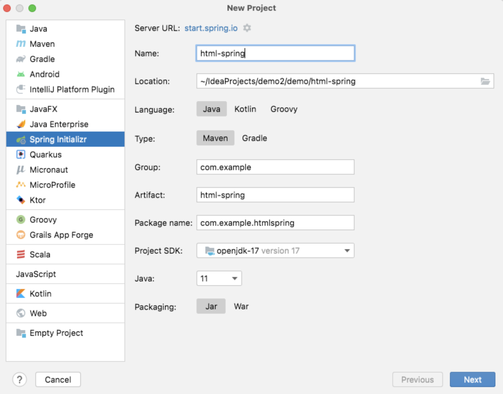
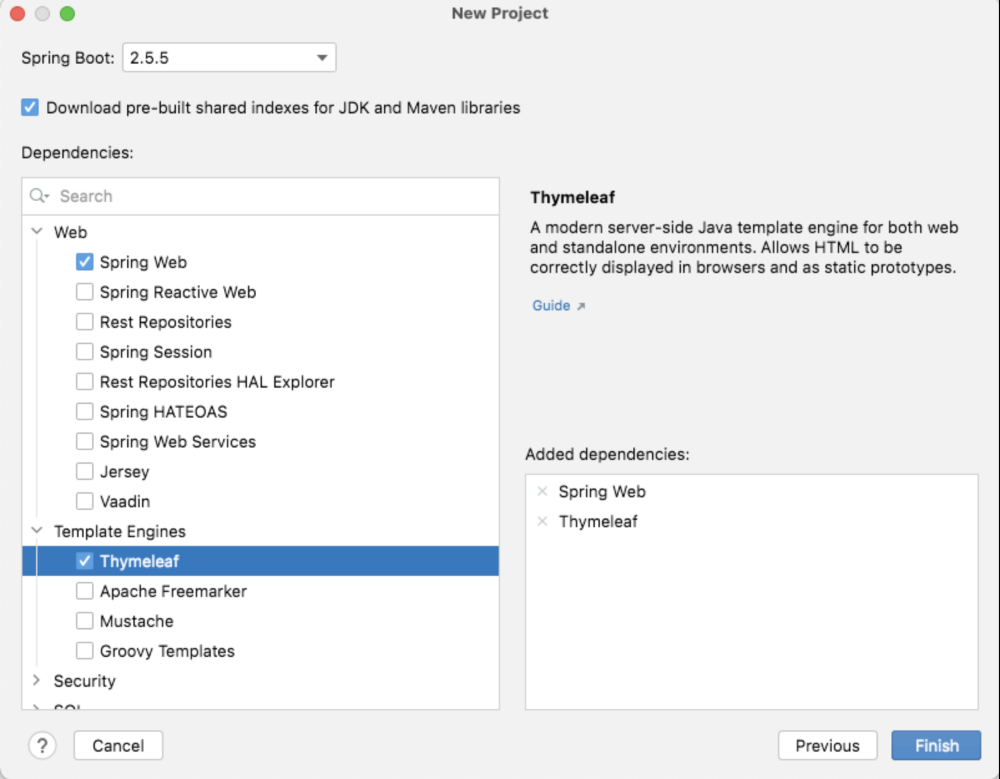
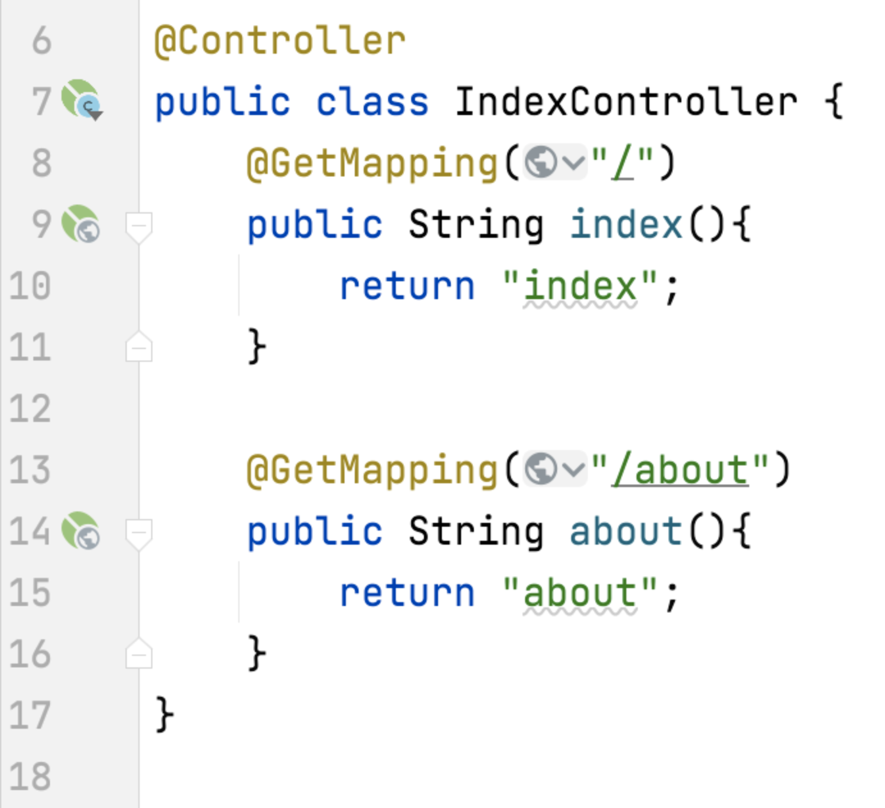
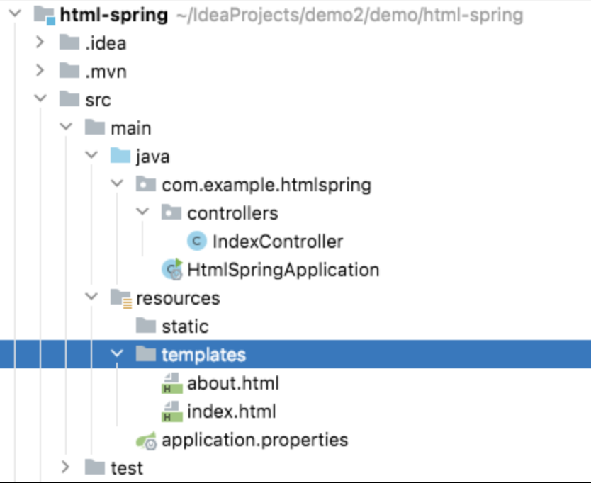
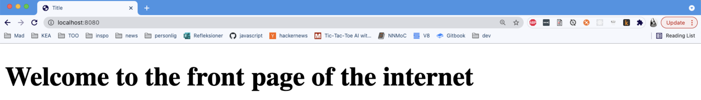
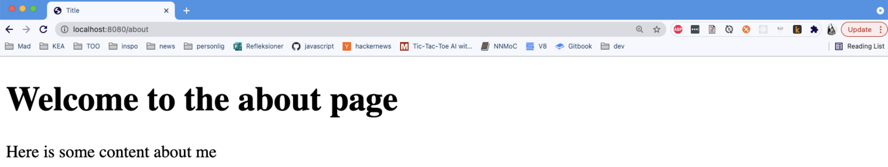

# HTML in Spring boot

Github example: [https://github.com/2-semester-programmering/html-spring](https://github.com/2-semester-programmering/html-spring)

**New project: Spring Initializr**

**IMPORTANT: Check Spring Web & Thymeleaf**

**Controller: Returning the names of HTML files**

**html files in the "templates" folder**

**Front page**

**About page**

