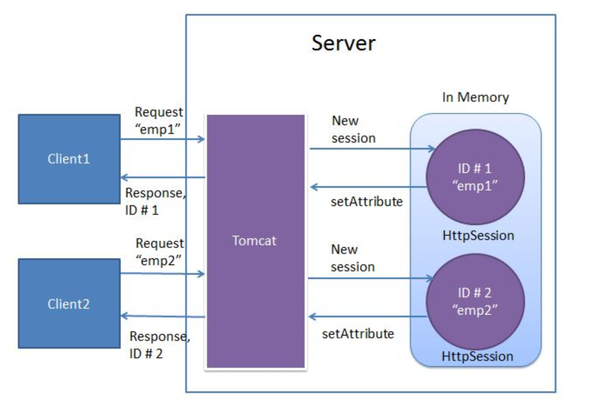
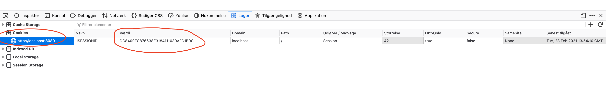
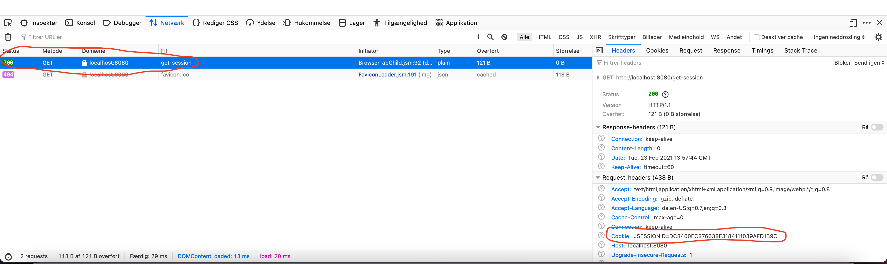

# Sessions

**Case**: https://github.com/nicklasdean/cookie-shop

- What is a session and why do we use it?
- Implementing session for spring boot
- Rendering sessions using Thymeleaf


## Sessions

When developing web applications sometimes we need to store data for a user. That could fx be to save data for a logged in user. It could also be to store previous searches from a user like Google maps does. 

Now the problem with that is that HTTP is stateless. This means that there is no state stored in a request. Each request is a completely new request.

This problem is solved using sessions. 




Example: Setting a Session with an object

```java
@Controller
public class CookieController {
    @GetMapping("/session")
    public String sessionExample(HttpSession session){
        Cookie cookieObject = new Cookie(1,"Magic",150);
        session.setAttribute("cookie", cookieObject);
        return "index";
    }
}
```

```java
@GetMapping("/getDataFromSession")
public String getDataFromSession(HttpSession session){
    Cookie magicCookie = (Cookie) session.getAttribute("cookie");
    return "index";
}
```

```java
@GetMapping("/invalidate-session")
public String invalidate(HttpSession session){
    session.invalidate();
    return "redirect:index";
}
```

Lets disect what happens here:

There are 3 endpoints

1. `/session` - Here we store the cookie object (`"cookieObject"`) under the key `"cookie"`
2. `/getDataFromSession` - Here we get the value stored under the `"cookie"` key
3. `/invalidate-session` - Here we invalidate (delete) the session


Let's dive into some of the code

- `request.getSession() ` to get the session we use the `getSession` method on the `request`

- `session.setAttribute("key", "value")` - Will save some data in the session. It will be in a key value format. Save this value at this key

- `session.getAttribute("key")` - Will get some value at the specified key
- `session.invalidate()` will invalidate/delete the session


### What can i save?

Anything you would like! `String`, `Integer`, `ArrayList`, some class it does not matter!


```java
@GetMapping("/set-users")
@ResponseBody
public String setSession(HttpServletRequest request) {
    HttpSession session = request.getSession();
    ArrayList<User> users = new ArrayList<>();
    User user1 = new User("benjamin", 23);
    User user2 = new User("peter", 45);
    users.add(user1);
    users.add(user2);
    session.setAttribute("users", users);

    return "two users saved in the session";
}

@GetMapping("/get-session")
@ResponseBody
public String getSession(HttpServletRequest request) {
  HttpSession session = request.getSession();
  List<User> users = (List<User>) session.getAttribute("users");

  return username.get(0).name;
}
```


## Cookies

In Spring boot sessions is implemented using cookies. Cookies is a small text file saved in the browser. This small text file gives the user an id so it knows who you are! Now every time you request a page from a specific domain, the `cookie` is sent with the request. Now the server know who requested a specific page.


Here is a screenshot of how the cookie is stored in the browser




Here is a screenshot of how the cookie id is sent in the request




## Sessions in Thymeleaf

To access the session in Thymeleaf simply use the `session`. We dont need to send the session from the `@Controller` to the view. 

```java
@GetMapping("/get-session-rendered")
public String getSessionRendered() {
    return "session.html";
}
```


**session.html**

```html
<div th:text="${session.username}">John Doe</div>
```


Since the sessions might not be there, its a good idea to check if they session data is available first:

```html
<div th:if="${session.containsKey('username')}" th:text="${session.email}"></div>
```


We can also use `session.size()` and `session.isEmpty()`


## Exercises

- Add functionality such that a customer can add cookies to his/her basket and change pages without losing the baskets state

- Add functionality such that the basket page displays the total sum of the price of cookies in his/hers basket


#### Advanced

- Refactor the code such that the navigation bar follows the DRY pattern

- Add functionality such that a user always can see how many items are in their basket on the menu