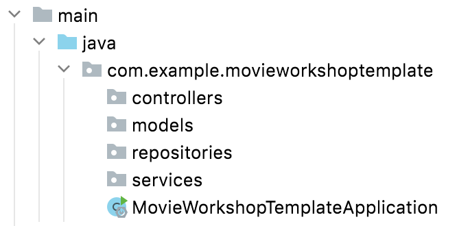

# Spring 2: Movie workshop

Inspiration or Fork from: [https://github.com/2-semester-programmering/movie-workshop](https://github.com/2-semester-programmering/movie-workshop)

When working with Spring, a usual structure/architecture of an application can look like this:



## Controllers

Represents the classes annotated with a @Controller tag or @RestController tag.

It is the responsibility for the controller classes to receive **requests** and return **responses** to the client

## Models

Represents domain objects - as we are building a movie-analysis application an obvious model could be a movie. A simple implementation could be:

```java
public class Movie{
    String title;
    int length
    //Constructors, getters, setters, toString etc
}
```

## Repositories

Represents the classes that interact with data - in this case it is a file - usually it interacts with databases or API's

## Services

Are classes that processes data and does business logic on the data. An example in this domain could be to find the longest running movie (movie with the highest length attribute). The service would then:

* Call the repository
  * The repository would fetch and return a list of all movies
* Find the longest running movie
* Return the longest running movie to the controller
